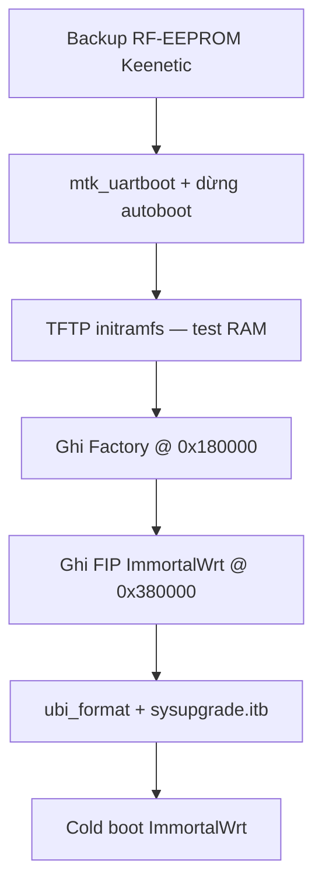

# Chuyển Viettel VHT-32X6V1 từ Keenetic sang ImmortalWrt

Router **đang chạy ROM Keenetic** dùng **bảng phân vùng khác** với ImmortalWrt/OpenWrt. Đó là nguyên nhân log UBI khi `mtk_uartboot` — **không phải lỗi nạp U-Boot qua UART**.

**Build tree:** `IMMORTALWRT/immortalwrt-mt798x-rebase/`  
**Board:** `viettel,vht-32x6`  
**Liên quan:** [flash-guide.md](flash-guide.md) · [WALKTHROUGH_VHT_32X6.md](WALKTHROUGH_VHT_32X6.md)

---

## 1. Vì sao thấy lỗi UBI sau mtk_uartboot?

`mtk_uartboot` **đã thành công** nếu bạn thấy log kiểu:

```
ubi0 error: scan_peb: bad image sequence number ...
** Cannot find mtd partition "ubi"
Loading Environment from UBI...
Erasing 0x00000000 ... 0x07a7ffff
resetting ...
( ( ( KeenBOOT by @yeezyio ) ) )
```

| Hiện tượng | Giải thích |
|------------|------------|
| Lỗi `image sequence` / `cannot attach mtd5` | U-Boot ImmortalWrt đọc partition `ubi` @ `0x580000`, nhưng NAND còn **UBI của Keenetic** (layout/volume khác) |
| `Erasing ... 0x07a7ffff` | U-Boot tự chạy `ubi_format` (xóa ~122 MB UBI) khi autoboot/`_firstboot` — **đừng để chạy nếu chưa backup** |
| Về menu KeenBOOT | U-Boot chỉ trong **RAM**; reset → BL2/FIP trên NAND vẫn là KeenBOOT |

**Kết luận:** Lệnh `mtk_uartboot` đúng. Cần **dừng autoboot** và boot TFTP initramfs, không để U-Boot tự format UBI.

---

## 2. Hai bảng phân vùng — chồng lấn vùng quan trọng

### Keenetic (ROM hiện tại)

| Tên ndm | Offset | Size | Ghi chú |
|---------|--------|------|---------|
| Preloader | `0x000000` | 512 KB | |
| U-Boot | `0x080000` | 2 MB | KeenBOOT nằm trong vùng này |
| U-Config | `0x280000` | 512 KB | |
| **RF-EEPROM** | **`0x300000`** | **2 MB** | WiFi cal + MAC |
| Firmware_1 | `0x500000` | ~29 MB | Keenetic OS (UBI bên trong) |

Trên Linux Keenetic: `RF-EEPROM` = `/dev/mtd4` (xem `VIETTEL_32X6/BACKUP_ROUTER/mtd-partitions.txt`).

### ImmortalWrt / Viettel stock

| Partition | Offset | Size | Ghi chú |
|-----------|--------|------|---------|
| BL2 | `0x000000` | 1 MB | |
| u-boot-env | `0x100000` | 512 KB | |
| **Factory** | **`0x180000`** | **2 MB** | WiFi cal + MAC Ethernet |
| **FIP** | **`0x380000`** | **2 MB** | ATF + U-Boot ImmortalWrt |
| **ubi** | **`0x580000`** | **~122 MB** | `fit`, `ubootenv`, `rootfs_data` |

### Vùng chồng lấn (9 conflict)

```
RF-EEPROM Keenetic  0x300000–0x500000  ∩  FIP ImmortalWrt  0x380000–0x580000
Firmware_1 Keenetic 0x500000–0x2280000 ∩  ubi ImmortalWrt   0x580000–0x8000000
```

Khi ghi **FIP ImmortalWrt** @ `0x380000`, bạn **xóa một phần RF-EEPROM Keenetic** → **bắt buộc backup EEPROM/MAC trước**.

> **Cảnh báo:** KeenBOOT menu **4** / web failsafe ghi FIP @ `0x080000` (layout NX32U) — **sai** cho 32X6 Viettel. Chỉ ghi FIP @ `0x380000` qua ImmortalWrt U-Boot hoặc `mtd write FIP`.

---

## 3. Chuẩn bị

### Phần cứng

- Cáp UART TTL **3.3 V**, 115200 8N1
- Cáp LAN vào **cổng LAN** (không WAN)
- PC: IP **`192.168.1.254/24`**

### Firmware (đã build)

```bash
cd IMMORTALWRT/immortalwrt-mt798x-rebase
./scripts/prepare-vht-32x6-config.sh
make -j$(nproc)
```

Sao chép vào TFTP:

```bash
chmod +x IMMORTALWRT/scripts/prepare-tftp-32x6.sh
IMMORTALWRT/scripts/prepare-tftp-32x6.sh /srv/tftp
```

| File TFTP | Mục đích |
|-----------|----------|
| `immortalwrt-mediatek-filogic-vht_32x6-initramfs-recovery.itb` | Test RAM / recovery |
| `immortalwrt-mediatek-filogic-vht_32x6-squashfs-sysupgrade.itb` | Cài production |
| `immortalwrt-mediatek-filogic-vht_32x6-bl31-uboot.fip` | Ghi FIP vĩnh viễn |
| `factory_immortalwrt.bin` | Factory (tạo ở bước 4) |

### Công cụ UART

```bash
cd IMMORTALWRT/mtk_uart
# Đóng picocom trước khi chạy!
sudo ./mtk_uartboot --serial /dev/ttyUSB0 \
  --payload bl2-mt7981-bga-ddr3-ram.bin \
  --fip fip/immortalwrt-mediatek-filogic-vht_32x6-bl31-uboot.fip \
  --aarch64
```

---

## 4. Quy trình cài đặt (tóm tắt)



---

## 5. Bước 1 — Backup RF-EEPROM (bắt buộc)

### Cách A — SSH khi Keenetic còn boot

```bash
ssh admin@192.168.1.1
dd if=/dev/mtd4 bs=128k | gzip > rf_eeprom_32x6.bin.gz
```

### Cách B — KeenBOOT console (menu 0)

Xem script: `IMMORTALWRT/scripts/uboot-keenetic-backup-32x6.txt`

```text
setenv ipaddr 192.168.1.1
setenv serverip 192.168.1.254
nand read 0x46000000 0x300000 0x200000
md.b 0x46000000 0x20
```

Kỳ vọng: `81 79 00 00` rồi 6 byte MAC WiFi.

### Tạo Factory cho ImmortalWrt

```bash
python3 IMMORTALWRT/scripts/build_factory_from_rf_eeprom.py rf_eeprom.bin \
  -o factory_immortalwrt.bin
```

Đặt `factory_immortalwrt.bin` vào thư mục TFTP. Kiểm tra MAC khớp nhãn dưới đáy (WAN thường = label − 1).

Offset MAC đúng trên Factory ImmortalWrt:

| Offset | Nội dung |
|--------|----------|
| `0x04` | WiFi MAC |
| `0x24` | LAN (switch) |
| `0x2a` | WAN |

---

## 6. Bước 2 — Vào U-Boot ImmortalWrt (RAM)

1. Đóng `picocom` / `minicom`
2. Chạy `mtk_uartboot` (lệnh ở mục 3)
3. Cắm nguồn khi tool handshake
4. Mở `picocom -b 115200 /dev/ttyUSB0`

### Dừng autoboot — quan trọng

`bootdelay=0` — U-Boot tự chạy `boot_ubi` rất nhanh.

| Cách | Thao tác |
|------|----------|
| **Giữ RESET** khi cắm nguồn | `check_buttons` → `boot_tftp` (cần initramfs trên TFTP) |
| Nhấn phím bất kỳ | Ngay khi thấy log U-Boot → gõ `bootmenu` |

**Không** chọn **[1] Initialize environment** cho đến khi đã ghi Factory + sẵn sàng format UBI.

Các lỗi UBI lúc khởi động là **bình thường** trên ROM Keenetic — bỏ qua nếu đã vào được prompt/menu.

---

## 7. Bước 3 — Test initramfs (không ghi NAND)

**Bootmenu [2]** — Boot system via TFTP

Hoặc lệnh:

```text
setenv ipaddr 192.168.1.1
setenv serverip 192.168.1.254
tftpboot 0x46000000 immortalwrt-mediatek-filogic-vht_32x6-initramfs-recovery.itb
bootm 0x46000000#config-1
```

Kiểm tra trong initramfs (tuỳ chọn):

```bash
# Sau khi có shell — nếu đọc được mtd
hexdump -C -n 48 /dev/mtd2   # Factory — có thể trống trước bước 8
```

Tắt nguồn → router về Keenetic (chưa ghi FIP).

---

## 8. Bước 4 — Ghi Factory

Từ U-Boot ImmortalWrt (mtk_uartboot hoặc sau khi đã ghi FIP):

```text
tftpboot 0x46000000 factory_immortalwrt.bin
mtd erase Factory
mtd write Factory 0x46000000
```

Verify:

```text
mtd read Factory 0x40080000 0x0 0x40
md.b 0x40080000 0x40
```

---

## 9. Bước 5 — Ghi FIP ImmortalWrt (vĩnh viễn)

**Bootmenu [7]** — Load BL31+U-Boot FIP via TFTP then write to NAND

Hoặc:

```text
tftpboot 0x46000000 immortalwrt-mediatek-filogic-vht_32x6-bl31-uboot.fip
mtd erase FIP
mtd write FIP 0x46000000
reset
```

Sau reboot: UART thấy banner **OpenWrt / ImmortalWrt**, **không** còn KeenBOOT. Từ đây **không cần** `mtk_uartboot` mỗi lần bật máy.

---

## 10. Bước 6 — Format UBI + cài sysupgrade

Lần đầu boot từ FIP mới, UBI Keenetic không tương thích:

```text
run ubi_format
```

Router reset. Vào bootmenu → **[5] Load production system via TFTP then write to NAND**

Hoặc thủ công:

```text
tftpboot 0x46000000 immortalwrt-mediatek-filogic-vht_32x6-squashfs-sysupgrade.itb
ubi part ubi
ubi check fit && ubi remove fit
ubi create fit $filesize dynamic
ubi write 0x46000000 fit $filesize
ubi read 0x46000000 fit && bootm 0x46000000#config-1
```

Chọn **[1] Initialize environment** một lần (đọc MAC Factory, tạo `ubootenv`).

---

## 11. Bước 7 — Cold boot & kiểm tra

Rút nguồn → cắm lại.

```bash
ssh root@192.168.1.1
cat /tmp/sysinfo/board_name          # viettel,vht-32x6
ubinfo -a | grep -E 'Name:|State:'
hexdump -C -n 48 /dev/mtd2           # Factory MAC đúng
```

Backup Factory sau cài đặt:

```bash
ssh root@192.168.1.1 "dd if=/dev/mtd2 bs=128k" > mtd2_Factory_$(date +%Y%m%d).bin
```

---

## 12. Gỡ lỗi

| Triệu chứng | Nguyên nhân | Xử lý |
|-------------|-------------|--------|
| UBI error ngay sau mtk_uartboot | ROM Keenetic, partition `ubi` khác | Bình thường — dừng autoboot, boot TFTP |
| Reset về KeenBOOT | U-Boot chỉ RAM / chưa ghi FIP | Ghi FIP bước 9 |
| TFTP timeout | IP/switch/file sai | PC `192.168.1.254`, tên file khớp chính xác |
| MAC random | Factory trống/sai offset | Nạp lại `factory_immortalwrt.bin` |
| `EEPROM in Flash is wrong` | Thiếu cal WiFi | Backup RF-EEPROM đầy đủ 2 MB |
| Brick sau ghi FIP | File FIP sai model | Khôi phục bằng `mtk_uartboot` + ghi lại FIP đúng |
| KeenBOOT menu 4 ghi FIP | Offset `0x080000` sai | Dùng ImmortalWrt U-Boot @ `0x380000` |

### Khôi phục KeenBOOT (nếu cần quay lại)

Xem `KEENETIC/scripts/recover_32x6_phase_a.txt` — ghi KeenBOOT @ `0x380000` (layout Viettel).

---

## 13. Script tham chiếu

| File | Mô tả |
|------|--------|
| `IMMORTALWRT/scripts/prepare-tftp-32x6.sh` | Copy artifact build → TFTP |
| `IMMORTALWRT/scripts/build_factory_from_rf_eeprom.py` | RF-EEPROM Keenetic → Factory ImmortalWrt |
| `IMMORTALWRT/scripts/uboot-keenetic-backup-32x6.txt` | Lệnh backup KeenBOOT |
| `IMMORTALWRT/scripts/uboot-immortalwrt-install-32x6.txt` | Lệnh cài từ U-Boot RAM |
| `KEENETIC/tools/analyze_32x6_layout.py` | Phân tích overlap partition |

---

*Cập nhật: 2026-06-11 — dựa trên verify phần cứng VHT-32X6V1 trong repo.*
